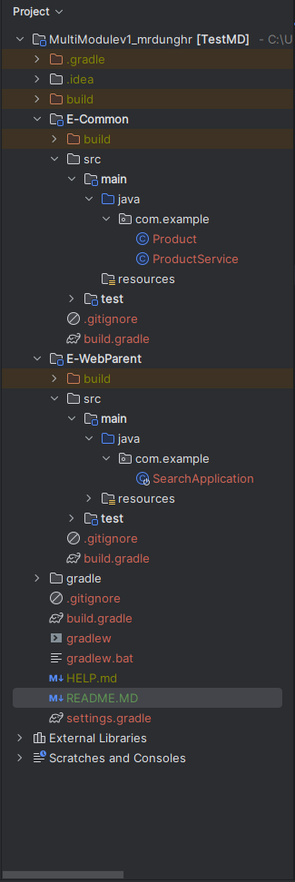

# Spring Boot Multi Module sử dụng Gradle

# Yêu cầu
- Gradle
- IntelliJ

# Cài đặt
- IntelliJ --> Create New Project --> Gradle + Java
- GroupId: com; ArtifactId: project_name
- Check "use auto-imports"
- Finish

# Cấu trúc dự án
- Cấu trúc dự án cơ bản.
- 

- Nếu project gốc có bất kỳ thư mục `src/` nào, cứ mạnh tay xóa nó. Không ảnh hưởng gì.

# Tạo Module mới
- Chúng ta sẽ tạo hai mô-đun:
    1. E-Common (là một thư viện có thể được sử dụng bởi tất cả các module ứng dụng)
    2. E-WebParent (Module ứng dụng để xử lý các yêu cầu. E-Parent sẽ bao gồm module E-Common.)

# Tạo module
- Nhấp chuột phải vào dự án gốc --> New --> Module
- Lựa chọn Gradle + Java
- ArtifactId điền "E-Common".
- Tiếp tới next ... Finish
- Bây giờ bạn có thể thấy trong `root/settings.gradle` chúng ta có **include 'E-Common'**.
- Tương tự chúng ta sẽ tạo module E-WebParent.
- Cuối cùng root/settings.gradle sẽ như sau,

```java
        rootProject.name = 'TestMD'
        include 'E-Common'
        include 'E-WebParent'
```

# Thiết lập mô-đun E-Common
- Mô-đun E-Common của chúng ta chỉ là một thư viện. Mô-đun này sẽ được chia sẻ giữa tất cả các mô-đun. Không sử dụng cái gì liên quan tới web ở đây. Chúng ta chỉ cần nói rằng đây là một ứng dụng để khởi động Spring-Boot.
- `E-Common/build.gradle`

```java
plugins {
    id 'java'
    id 'org.springframework.boot' version '2.7.13'
    id 'io.spring.dependency-management' version '1.0.15.RELEASE'
}

group = 'com.example'
version = '0.0.1-SNAPSHOT'

java {
    sourceCompatibility = '1.8'
}

repositories {
    mavenCentral()
}

dependencies {
    implementation 'org.springframework.boot:spring-boot-starter'
    testImplementation 'org.springframework.boot:spring-boot-starter-test'
}

tasks.named('test') {
    useJUnitPlatform()
}
```

- Hãy tạo thư mục nguồn. Nhấp chuột phải vào E-Common module --> New --> Directory --> src/main/java
- Nhấp chuột phải vào E-Common/src/main/java --> New --> Package -->  com.ecommon
- Tạo class `Product`(id, name, price) dưới package `com.ecommon`.
- Đó là nó. mô-đun chung đã sẵn sàng để sử dụng.
- gõ dưới terminal, `./gradlew build` để kiểm tra tình trạng build.

# Thiết lập mô-đun ứng dụng E-WebParent
- Mô-đun E-Common là một ứng dụng phục vụ yêu cầu API và trả về phản hồi. Do đó, chúng ta cần bao gồm phần phụ thuộc web cho mô-đun này. **THêm những thư viện cần thiết cho mục đích của chính bạn, ở đây demo nên dùng những thư viện nhỏ để test.**
- Ngoài ra mô-đun E-WebParent yêu cầu mô-đun chung. Bao gồm nó dưới sự phụ thuộc như - `compile project(':E-Common')`
- `E-WebParent/build.gradle`
```java
plugins {
    id 'java'
    id 'org.springframework.boot' version '2.7.13'
    id 'io.spring.dependency-management' version '1.0.15.RELEASE'
}

group = 'com.example'
version = '0.0.1-SNAPSHOT'

java {
    sourceCompatibility = '1.8'
}

repositories {
    mavenCentral()
}

dependencies {
    implementation('org.springframework.boot:spring-boot-starter-actuator')
    implementation('org.springframework.boot:spring-boot-starter-web')
    implementation project(':E-Common')
    testImplementation('org.springframework.boot:spring-boot-starter-test')
}

tasks.named('test') {
    useJUnitPlatform()
}
```
- Tạo src/main/java/ thư mục dưới E-Common. tạo package com.ecommon.
- Tạo class `Product` và `ProductService` với mã sau,
```java
public class Product {
    private long id;
    private String name;
    private double price;

    public Product() {
    }

    public Product(long id, String name, double price) {
        this.id = id;
        this.name = name;
        this.price = price;
    }

    public long getId() {
        return id;
    }

    public void setId(long id) {
        this.id = id;
    }

    public String getName() {
        return name;
    }

    public void setName(String name) {
        this.name = name;
    }

    public double getPrice() {
        return price;
    }

    public void setPrice(double price) {
        this.price = price;
    }

    @Override
    public String toString() {
        return "Id = " + this.getId() + ", name = " + this.getName() + ", price = " + this.getPrice();
    }
}
public class ProductService {
    private static final List<Product> products = new ArrayList<>();

    // To initialize all the products.
    // khởi tạo một danh sách sản phẩm
    static {
        for (long i = 1; i <= 5; i++) {
            Product p = new Product(i, "Product-" + i, 1000d * i);
            products.add(p);
        }
    }


    public static List<Product> getProducts() {
        return products;
    }

    public static boolean createProduct(Product product) {
        try {
            product.setId(products.size() + 1);
            products.add(product);
        } catch(Exception e) {
            return false;
        }
        return true;
    }
}
```

- Tạo src/main/java/ thư mục dưới E-WebParent. tạo package com.webparent.
- Tạo class `SearchApplication` với mã sau,
```java
@RestController
@SpringBootApplication(scanBasePackages = {"com"})
@RequestMapping("/search")
public class SearchApplication {

    //Simple GET call to test this application.
    //cách đơn giản nhất để kiểm tra app có ổn không
    @RequestMapping("/hello")
    @GetMapping
    public String hello() {
        return "Search: Hello";
    }

    //Simple GET call to see whether we are able return a class as JSON.
    //kiểm tra 1 sản phẩm có tồn tại không
    @RequestMapping(value = "/product",
            method = RequestMethod.GET,
            produces = {"application/json"})
    public Product product() {
        return new Product(1, "Laptop", 45000d);
    }

    //Get call using a Path param and return a Product as JSON.
    //tìm 1 sản phẩm
    @RequestMapping(value = "/product/{id}",
            method = RequestMethod.GET,
            produces = {"application/json"})
    public Product productWith(@PathVariable("id") long id) {
        Optional<Product> product = ProductService.getProducts()
                .stream()
                .filter(p -> p.getId() == id)
                .findFirst();
        return product.get();
    }

    //GET to return list of Products as JSON.
    //lấy danh sách sản phẩm
    @RequestMapping(value = "/products",
            method = RequestMethod.GET,
            produces = {"application/json"})
    public List<Product> products() {
        return ProductService.getProducts();
    }

    //POST call to insert a new Product.
    //thêm sản phẩm mới
    @RequestMapping(value = "/product/create",
            method = RequestMethod.POST,
            consumes = {"application/json"}
    )

    // post_create_product
    public String createProduct(@RequestBody Product product) {
        if (ProductService.createProduct(product)) {
            return "Created Product = " + product.toString();
        }

        return "Creation failed for Product = " + product.toString();
    }

    public static void main(String[] args) {
        SpringApplication.run(SearchApplication.class, args);
    }
}
```
# Get Product bằng cách chuyển id của nó sử dụng @PathVariable
- NOTE:
  @PathVariable là lấy giá trị từ URL.
  @RequestBody được sử dụng khi chúng ta chuyển đầu vào như JSON/XML vân vân. (Bạn sẽ thấy cách sử dụng này sau)
- Tạo `com.ecommon.ProductService` để tạo ra product.
    1. Để tìm kiếm theo id của product theo id được thông qua như một url param.
    2. Để trả về một danh sách products như JSON.
# Dùng PostMan để kiểm thử API